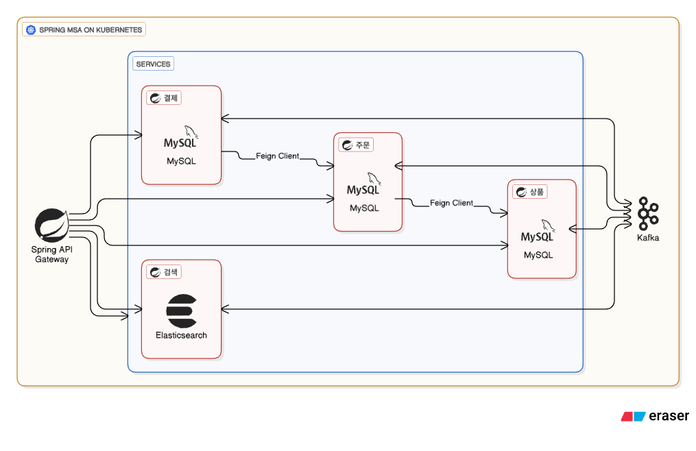
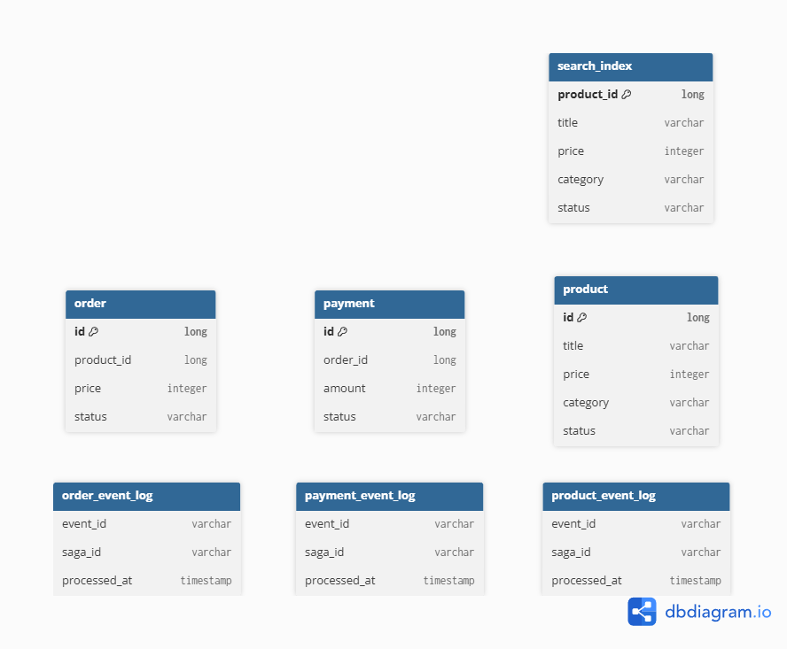
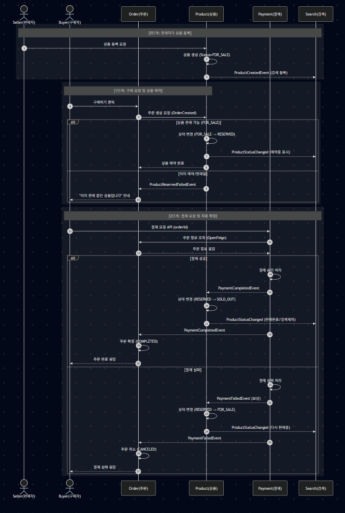

#  Spring MSA 기반 중고거래 플랫폼
> **상품 등록부터 주문, 결제까지 마이크로서비스 아키텍처(MSA) 및 이벤트 기반 설계를 적용한 백엔드 시스템**

## 1. 프로젝트 개요
* **목표**: 대규모 트래픽 확장을 고려한 MSA 구조 설계 및 분산 환경에서의 **데이터 최종 일관성** 확보
* **핵심 키워드**: MSA, Hexagonal Architecture, Saga Pattern, Kafka, Elasticsearch
* **주요 기능**:
    * **상품 관리**: 판매자의 상품 등록 및 **Elasticsearch** 검색 인덱스 동기화
    * **주문 프로세스**: 상품 상태 제어(`SALE` → `RESERVED` → `SOLD`) 및 주문 생성
    * **결제 및 보상 트랜잭션**: 분산 트랜잭션 내 결제 승인/실패 처리 및 자동 복구 로직

## 2. 기술 스택
* **Backend**: Java 21, Spring Boot, Spring Cloud (Gateway, OpenFeign), JPA
* **Storage**: MySQL, Elasticsearch
* **Messaging**: Apache Kafka
* **Infrastructure**: Kubernetes, Docker

## 3. 시스템 아키텍처

- **Spring Cloud Gateway**를 단일 진입점으로 설정
- **동기(Feign)**와 **비동기(Kafka)** 통신을 혼합하여 시스템 성능과 신뢰성 최적화

## 4. 데이터베이스 설계 (ERD)

* **Event Log Table**: **Event ID**를 활용하여 메시지 중복 처리를 방지하고 **멱등성(Idempotency)** 보장
* **Saga ID**: 분산 트랜잭션 전 과정을 추적하기 위해 모든 서비스 로그에 **saga_id** 공통 관리

## 5. 핵심 비즈니스 로직 및 트랜잭션 관리

### 💡 기술적 해결 과제
* **실용적인 헥사고날 아키텍처 (Pragmatic Hexagonal)**
    * **Port & Adapter**: 인터페이스를 통해 도메인 로직을 보호하고 외부 기술(DB, Kafka) 의존성 분리
    * **Trade-off**: 도메인 모델과 JPA 엔티티를 통합하여 매핑 오버헤드를 줄이고 개발 생산성 확보
* **분산 트랜잭션 관리 (Saga Pattern)**
    * 결제 실패 시 `PaymentFailedEvent` 발행 → 재고 복구 및 주문 취소 처리를 통한 **보상 트랜잭션** 구현
* **데이터 정합성 및 상태 제어**
    * **상태 머신**: `SALE` → `RESERVED` → `SOLD` 단계별 상태 제어로 **중복 결제 방지**
    * **CQRS**: 상품 변경 사항을 Kafka로 발행하여 검색 전용 인덱스(ES)와 즉각적인 데이터 동기화

## 6. API 명세 (핵심 요약)
| 도메인 | 메서드 | 엔드포인트 | 설명 |
| :--- | :---: | :--- | :--- |
| **Product** | `POST` | `/products` | 상품 등록 및 검색 엔진 인덱싱 |
| **Order** | `POST` | `/orders` | 주문 생성 및 상품 상태 예약 (`RESERVED`) |
| **Payment** | `POST` | `/payments` | 결제 승인 및 **Saga** 프로세스 시작 |
| **Search** | `GET` | `/search/products` | 전체 및 카테고리별 상품 검색 |

## 7. 성장 포인트 및 회고
* **전략적 아키텍처 선택**: 이론적인 완벽함보다 프로젝트 목적에 맞춰 **도메인-JPA 통합**과 같은 실용적인 설계의 이점을 경험함
* **분산 시스템 이해**: **Feign vs Kafka**의 트레이드 오프를 고려하여 서비스 간 결합도를 낮추고 데이터 정합성을 해결함
* **테스트 기반 마련**: 헥사고날 구조를 통해 비즈니스 로직을 격리하여, 향후 **단위 테스트**를 유연하게 도입할 수 있는 기반 확보